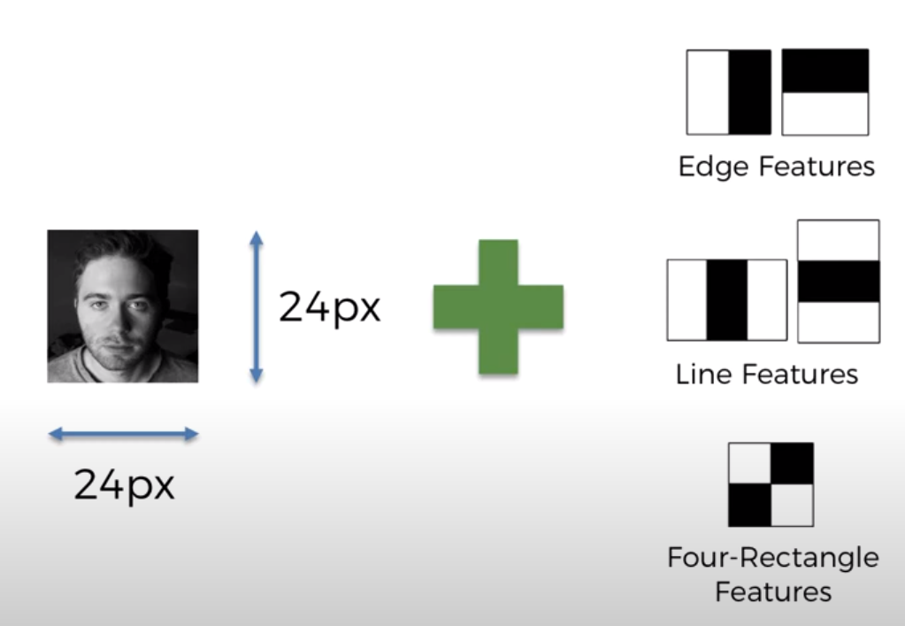

<a>Video Ref : https://www.youtube.com/watch?v=nvg0L0c0iPI&t=24997s</a>
<h4>till today, oct2020 . ONLY SSD AND YOYO can detect object after looking only once!</h4>
<h1>The Viola_johns Algorithm</h1>

Includes training & detection(same as training and prediction)
This algorithm is designed to detect frontal faces. 
Gray-scale (less data, easier to process)
Scan the similar sequence of CNN, Look for feature of face.

<a>http://citeseerx.ist.psu.edu/viewdoc/download?doi=10.1.1.10.6807&rep=rep1&type=pdf</a>

<h3>Haar-Like Features</h1>

Edge Features.Line Features . Four-rectangle Features. 

each block of image array is compared with features mentioned above.
eg, if nose is trained to have such a pattern. The algorithm will look for that pattern. and a threshold is set to decide what an array need to be to be classified as such feature.

                                                                                                   
<h3>Integral Image</h1>    

speed up the feature scanning, number on each pixel equal to the sum of all the number in the rectangle of <----x axis and ^ y axis. 

  
  <h3>Training Classifier</h3>
  
24px X 24px 

  
  <h1>AdaBoost</h1>
  
problem for standard feature extraction: too many features, very slow. 
  <strong>adaptor Booster use many weak classifier to build a strong classifier f(x)= a1*f1(x)+a2*f2(x)+...... </strong>

  
  <h3>Cascading </h3>
  
   <strong>Cascading use many strong classifier （one feature per classifier）to build a multi layer classifier f(x)= a1*f1(x)+a2*f2(x)+...... </strong>
   
  　<h1> SSD -single shot multi box detection </h1>
<a>https://arxiv.org/pdf/1512.02325.pdf</a>

image pass through layers as a whole, not convelutional
break down image into segments. detect if object in per box.

